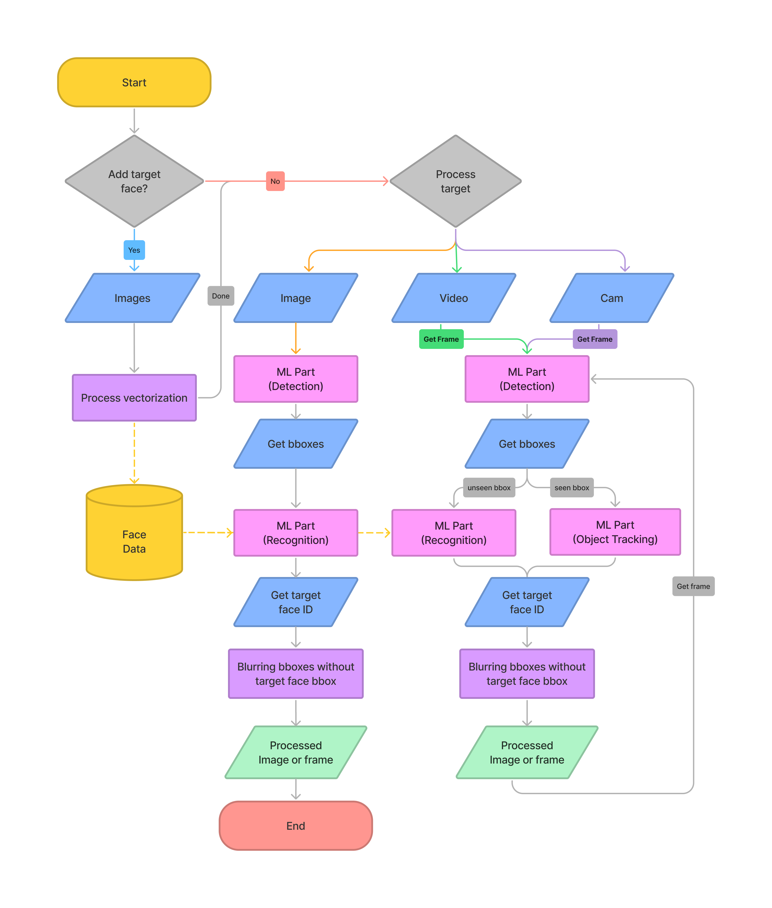
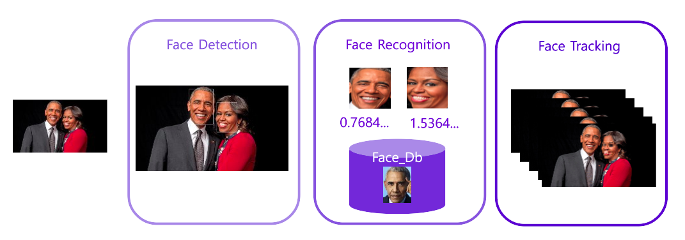

# MOFY: MOsaic For You 실시간 불특정 인물 비식별화

배우 송중기를 제외한 모든 인물 비식별화 결과 (식별 대상에 박스 처리)

## 멤버
| 김영운 | 이승현 | 임서현 | 전성휴 | 허석용 |  
| :-: | :-: | :-: | :-: | :-: |  
|[Github](https://github.com/Cronople) | [Github](https://github.com/sseunghyuns) | [Github](https://github.com/seohl16) | [Github](https://github.com/shhommychon) | [Github](https://github.com/HeoSeokYong)

## Project Overview 
### 목표 
웹서비스를 기반으로 사진이나 동영상, 실시간 영상에서 유저가 등록, 지정한 특정 인물들 이외의 사람들의 얼굴을 AI로 비식별화 처리해주는 초상권 보호 솔루션(Mosaic for you,  MOFY)을 제공하고자 한다.
실시간 영상에서도 지연이 적고 강력한 보호 솔루션이 프로젝트의 핵심 목표이다.

### 기대효과 
- 유튜브 야외 방송 / 동영상 촬영 등에서 원치않게 노출되는 일반인에 대한 실시간 비식별화로 일반인의 초상권을 보호할 수 있다.
- 실시간 방송에서 불특정 대상에 대한 초상권 보호로 방송 컨텐츠의 다양한 확장을 기대해볼 수 있다.
- 수동적인 동영상 편집 과정 없이 모자이크를 자동으로 처리해주어 편집 노동력을 줄일 수 있다.

## Demo 

1. 축구선수 손흥민을 제외한 모든 인물 비식별화 결과 (식별 대상에 박스 처리)

2. 뉴스에서 기자와 인터뷰이를 제외한 모든 인물 비식별화 결과

3. 인터넷 방송에서 방송자와 인터뷰이를 제외한 모든 인물 비식별화 결과

## Flow Chart

## Model 

- Face Embedding : 식별화 대상의 얼굴 영역을 embedding하여 데이터베이스화
- Face Detection : 영상 내 사람의 얼굴 탐지 
- Face Recognition: 탐지된 얼굴을 식별 인물 데이터와 비교하여 일치도 검사
- Face Blurring: 등록된 인물과 일치하는 대상을 제외한 인원에 대해 비식별화 처리
- Face Tracking: 실시간 처리와 예측 오차를 줄이기 위해 이전 프레임의 정보를 활용하여 인물 식별 기능 강화 

## 추가 발전 방향
- 모바일 앱 환경에서도 서비스를 제공. 
- 자동차 표지판 등 다른 부문에서 개인정보가 침해될 수 있는 정보도 비식별화.

## Using Library
- Pytorch
- OpenCV
- NumPy
- MoviePy

## Environment 
- Python 3.8 
